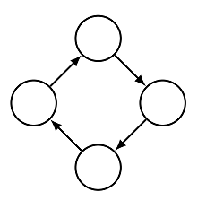

# Getting Started

The GP 2 compiler translates a GP 2 program into executable C code. The generated code is executable with the support of the GP 2 library. There are two ways to set it up. You can build the compiler using make. However, the setup process is not guaranteed to be stable on all Linux machines, or on machines running MacOS or Windows. We therefore provide an installation via Docker as an alternative for Linux and MacOS.

## Installation

To run the compiler, you need to install the C library [Judy](http://judy.sourceforge.net/index.html) which you may find in your distribution's package manager. In the Ubuntu repositories, you can find it under ``libjudy-dev``.

There are several ways to install the compiler:

- [**Pre-built**](https://github.com/UoYCS-plasma/GP2/tree/gh-pages/pre-built) - Use a version of the compiler that has already been built. This might not work correctly on every Linux distribution, but does work on Ubuntu 18.04 for instance.
- [**Build from source code**](installation/buildcompiler) - Follow the link for a guide on how to build the compiler yourself.
- [**Docker**](installation/docker) - Follow the link for instructions on how to install the compiler via Docker. This method is recommended for MacOS users.
- **University of York** - In the Department of Computer Science, the compiler is installed on most Linux machines.

## Usage

Usage depends on which installation method you used:

- **Pre-built** - [bash file usage](usage/pre-built)
- **Build from source code** - [usage guide](usage/compiler), [bash file usage](https://github.com/UoYCS-plasma/GP2/tree/master/bin/compiler)
- **Docker** - [bash file usage](https://github.com/UoYCS-plasma/GP2/tree/master/bin/docker)
- **University of York** - [usage guide](usage/uoy)


## Example: Editing, Compiling, and Running a Transitive Closure Program

For this section, we assume that we can run GP 2 programs with using the command `gp2c <program_file> <graph_file>`.

The program we'll look at is this:


This program computes the **transitive closure** of a graph. The transitive closure of a graph is the smallest extension of that graph that is **transitive**.
A graph is transitive when for every pair of nodes *v1, v2* with a path from *v1* to *v2*, there is an edge directly from *v1* to *v2*.

For example, this graph is *not* transitive:



There is a path from the left-most node to the right-most node but there is no edge directly from the left-most node to the right-most node. 
The purpose of the program we're looking at is the *transform* this graph into the smallest extension of this graph which *is* transitive. 

Firstly, let's get this graph in a usable form. Try writing the graph out as:

```
[
	(0, empty)
	(1, empty)
	(2, empty)
	(3, empty)
	|
	(4, 0, 1, empty)
	(5, 1, 2, empty)
	(6, 2, 3, empty)
	(7, 3, 0, empty)
]
```

What does this mean? Well the square brackets `[ ... ]` surround the entire graph's structure. Then the nodes are listed, for example; `(0, empty)` indicates that there is
a node which we will identify as node 0 and this node is unlabelled (its label is 'empty'). After the nodes are listed, there is a divider; `|`, and then edges are
listed. The edge `(4, 0, 1, empty)` describes an edge from node 0 to node 1 which is also unlabelled. 

Save this graph as *"cycle.host"*. 


Try writing this program out in text form:

```
Main = link!

link(a, b, c, d, e : list)
[
	(n1, a)
	(n2, c)
	(n3, e)
	|
	(e1, n1, n2, b)
	(e2, n2, n3, d)
]
=>
[
	(n1, a)
	(n2, c)
	(n3, e)
	|
	(e1, n1, n2, b)
	(e2, n2, n3, d)
	(e3, n1, n3, empty)
]
interface = 
{
	n1, n2, n3
}
where not edge(1, 3)
```

and saving it as *"transitive_closure.gp2"*. The general form of a program in text form is:

```
Main = [PROGRAM CODE]

[RULE 1]
[RULE 2]
[RULE 3]
```

And an individual rule is of the form:

```
[RULENAME]
(
	[VARIABLES]
)
[LEFT HAND SIDE GRAPH]
=>
[RIGHT HAND SIDE GRAPH]
interface = { [INTERFACE] }
[CONDITION]
```

Where graphs are of the same form as the graph we saw earlier. 

So what does our program mean? The only line of the main program is `Main = link!`. This `!`  means that the rule `link` will be applied as long as possible - e.g. it will be applied
until it is no longer applicable. Applying the rule `link` firstly searches for a match for its left hand side; 3 adjacent nodes where there is not an edge
from the 1st node to the 3rd node. Then, once a match is found, the left hand side is transformed into the right hand side by inserting an edge from the 1st
node to the 3rd node. The 'interface' describes which nodes survive; none of the 3 matched nodes `n1, n2, n3` are deleted. 

Now we can compile our program by calling:

```
gp2c PATH/TO/transitive_closure.gp2 PATH/TO/cycle.host
```
This will output the following graph:


## License

See the file [LICENSE](https://github.com/UoYCS-plasma/GP2/blob/master/LICENSE).

## Authors

The GP 2 language was designed by [Detlef Plump](http://www-users.cs.york.ac.uk/~det/).

The GP 2 compiler and runtime library was developed by Christopher Bak. Recent improvements to the compiler were implemented by [Graham Campbell](https://gjcampbell.co.uk/) and [Jack Romo](http://jackromo.com/).
